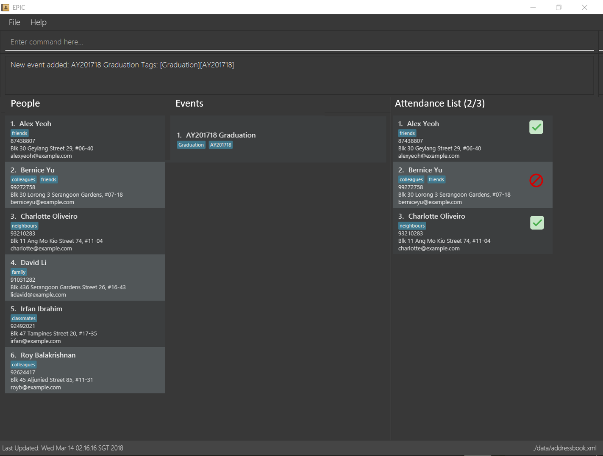

= Event Planning isn't Complicated (EPIC)
ifdef::env-github,env-browser[:relfileprefix: docs/]

image:https://travis-ci.org/CS2103JAN2018-W13-B2/main.svg?branch=master["Build Status", link="https://travis-ci.org/CS2103JAN2018-W13-B2/main"]
https://ci.appveyor.com/project/bayweiheng/addressbook-level4[image:https://ci.appveyor.com/api/projects/status/cg7fn8xpqohspy9k?svg=true[Build status]]
https://coveralls.io/github/CS2103JAN2018-W13-B2/main?branch=master[image:https://coveralls.io/repos/github/CS2103JAN2018-W13-B2/main/badge.svg?branch=master[Coverage Status]]
https://www.codacy.com/app/damith/addressbook-level4?utm_source=github.com&utm_medium=referral&utm_content=se-edu/addressbook-level4&utm_campaign=Badge_Grade[image:https://api.codacy.com/project/badge/Grade/fc0b7775cf7f4fdeaf08776f3d8e364a[Codacy Badge]]
https://gitter.im/se-edu/Lobby[image:https://badges.gitter.im/se-edu/Lobby.svg[Gitter chat]]

ifdef::env-github[]

endif::[]

ifndef::env-github[]
image::images/Ui.png[width="600"]
endif::[]

* This is a desktop application facilitating planning for large events in schools. It has a GUI but most of the user interactions happen using a CLI (Command Line Interface).
* It is a Java application *written in OOP fashion*.
* It has support for _Build Automation_ using Gradle and for _Continuous Integration_ using Travis CI.

== Site Map

* <<UserGuide#, User Guide>>
* <<DeveloperGuide#, Developer Guide>>
* <<AboutUs#, About Us>>
* <<ContactUs#, Contact Us>>

== Acknowledgements

* Some parts of this sample application were inspired by the excellent http://code.makery.ch/library/javafx-8-tutorial/[Java FX tutorial] by
_Marco Jakob_.
* Libraries used: https://github.com/TomasMikula/EasyBind[EasyBind], https://github.com/TestFX/TestFX[TextFX], https://bitbucket.org/controlsfx/controlsfx/[ControlsFX], https://github.com/FasterXML/jackson[Jackson], https://github.com/google/guava[Guava], https://github.com/junit-team/junit4[JUnit4]
* The code was modified from the https://github.com/se-edu/addressbook-level4[AddressBook-Level4 project], created by the https://github.com/se-edu/[SE-EDU initiative]

== Licence : link:LICENSE[MIT]
